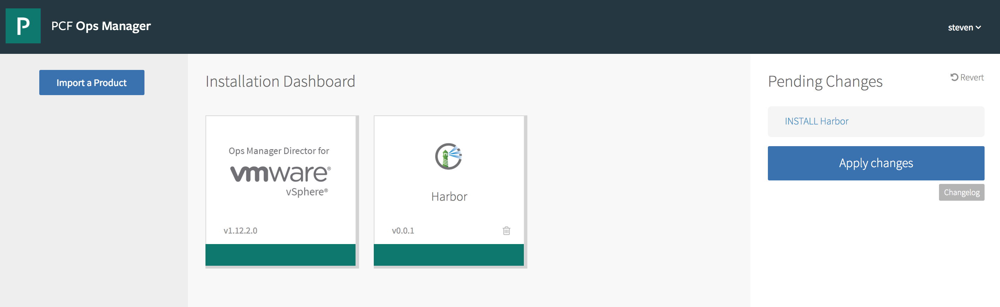
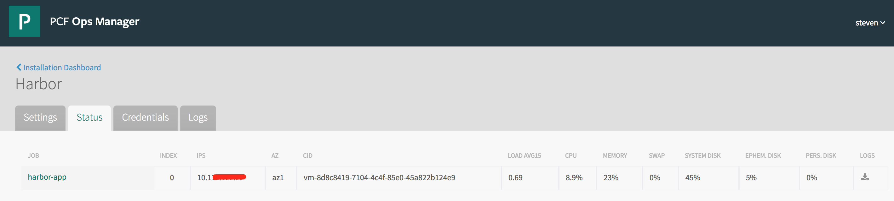

# harbor-tile
Project to build the tile for Harbor based on Harbor bosh release.

**NOTES: Tile for Harbor is still under development. It's very unstable and may be not usable some time.**

## Package
[Tile](https://docs.pivotal.io/tiledev/tile-structure.html) in this project is built based on the [Harbor](https://github.com/vmware/harbor) [bosh](https://bosh.io) [release](https://github.com/steven-zou/harbor-bosh-release) created before.

```
packages:
- name: harbor
  type: bosh-release
  path: resources/habo.tgz
```

## Setup DEV environment
### Tile Generator
Pivotal recommends using [virtualenv](https://virtualenv.pypa.io/en/stable/) to setup the development environment. Install the **tile-generator** in the virtual environment created by virtualenv.
```
//create env
virtualenv -p /usr/local/python tile-generator-env

//activate env
source tile-generator-env/bin/activate

//install tile-generator
pip install tile-generator
```

### Pivotal Ops Manager
If you want to build you own ops manager environment to validate the tile you build, you can follow the document below to deploy Ops Manager on vSphere (For other IaaS platform, please refer the Povital document).

* [Deploying Operations Manager to vSphere](http://docs.pivotal.io/pivotalcf/1-12/customizing/deploying-vm.html)
* [Configuring Ops Manager Director for VMware vSphere](http://docs.pivotal.io/pivotalcf/1-12/customizing/vsphere-config.html)

## Build and Test
Use the following command to initialize tile project if not create yet.
```
cd YOUR-PROD-DIRECTORY
tile init

```

**NOTES:To avoid keeping too large files in this repository, the Harbor BOSH release tarball this tile required is not pushed here. So before building the tile, you need to create the Harbor BOSH release tarball firstly if you don't have it in hands.**

Create Harbor BOSH release with tarball and put it under the resource folder. If tarball name changed, don't forget to change the release reference in the tile.yml.
```
git clone https://github.com/steven-zou/harbor-bosh-release

cd harbor-bosh-release

#--force create dev release, --final create formal release
bosh create-release --name harbor-bosh-release --version <new version> --tarball=<tarball path and name> --[force/final]

```

Edit the generated **tile.yml** file to define your tile.
```
---
# The high-level description of your tile.
# Replace these properties with real values.
#
name: harbor-tile # By convention lowercase with dashes
icon_file: resources/harbor.png
label: Harbor
description: Project Harbor is an enterprise-class registry server that stores and distributes Docker images. Harbor extends the open source Docker Distribution by adding the functionalities usually required by an enterprise, such as security, identity and management.
# metadata_version: 1.8                 # Optional, defaults to 1.5

# Global defaults (all optional)
#
# org: test-org                         # Name of org to create for your apps
# space: test-space                     # Name of space to create for your apps
# apply_open_security_group: true       # Apply open security group, default: false

# Specify the packages to be included in your tile.
# The format of the section to include depends on the type
# of package you are describing. For fragments of each type
# that you can copy & paste, see:
#
# https://github.com/cf-platform-eng/tile-generator/blob/master/README.md
#
packages:
- name: harbor
  type: bosh-release
  path: resources/harbor-0.3.0.tgz
  jobs:
  - name: docker
    templates:
    - name: docker
      release: harbor
    cpu: 1
    memory: 4096
    ephemeral_disk: 10240
    persistent_disk: 20480
    instances: 1
    static_ip: 0
    dynamic_ip: 1
    default_internet_connected: false
    max_in_flight: 1
  
  - name: harbor-app
    templates:
    - name: harbor
      release: harbor
    cpu: 1
    memory: 4096
    ephemeral_disk: 10240
    persistent_disk: 20480
    instances: 1
    static_ip: 0
    dynamic_ip: 1
    default_internet_connected: false
    max_in_flight: 1
    properties:
      ui_url_protocol: (( .properties.ui_url_protocol.value ))
      admin_password: (( .properties.admin_password.value ))
      db_password: (( .properties.harbor_db_password.password ))
      clair_db_password: (( .properties.clair_db_password.password ))
      with_clair: (( .properties.with_clair.value ))
      with_notary: (( .properties.with_notary.value ))
      ssl:
        cert: (( .properties.server_cert_key.cert_pem ))
        key: (( .properties.server_cert_key.private_key_pem ))
        ca: (( $ops_manager.ca_certificate ))


# Include stemcell criteria if you don't want to accept the default.
# Since this stemcell is only used to run pre and post errands, we
# strongly recommend you leave this alone so that your tile always
# runs with the latest stemcell.
#
stemcell_criteria:
  os: ubuntu-trusty
  requires_cpi: false
  version: '3445.11'

# Add properties you want to pass to your applications.
# Properties specified here will not be configurable by the user.
#
properties:
- name: clair_db_password
  type: simple_credentials
  label: Clair database password
  description: The password for the database used by Clair
- name: harbor_db_password
  type: simple_credentials
  label: Harbor database password
  description: The password for the database used by Harbor itself

# Uncomment this section if you want to display forms with configurable
# properties in Ops Manager. These properties will be passed to your
# applications as environment variables. You can also refer to them
# elsewhere in this template by using:
#     (( .properties.<property-name> ))
# 
forms:
- name: harbor_properties
  label: Harbor Configurations
  description: Set the following properties to confgure Harbor
  properties:
  - name: ui_url_protocol
    type: dropdown_select
    label: HTTP Protocol
    description: The protocol for accessing the UI and token/notification service
    options:
    - name: https
      label: HTTPS
      default: true
    - name: http
      label: HTTP
  - name: admin_password
    type: secret
    label: Admin Password
    description: The password for the system administrator

- name: certificate_settings
  label: Certificate
  description: Configure the SSL certificate and private key for Harbor
  properties:
  - name: server_cert_key
    type: rsa_cert_credentials
    label: SSL Certificate and key PEMs

- name: clair_settings
  label: Clair Settings
  description: Determine if include Clair in the deployment to support vulnerability scanning
  properties:
  - name: with_clair
    type: boolean
    label: Install Clair
    description: Checked to install Clair

- name: notary_settings
  label: Notary Settings
  description: Determine if include Notary in the deployment to support content trust
  properties:
  - name: with_notary
    type: boolean
    label: Install Notary
    description: Checked to install Notary

- name: uaa_settings
  label: UAA Settings
  description: Set the UAA configurations as AUTH provider(Experimental)
  properties:
  - name: uaa_address
    type: string
    label: UAA Address
  - name: uaa_client_id
    type: string
    label: Client id
  - name: uaa_client_secret
    type: secret
    label: Client Secret

# Add any dependencies your tile has on other installed products.
# This is often appropriate when using automatic service provisioning
# for any of your packages above, with services provided by other
# products.
#
# requires_product_versions:
# - name: p-mysql
#   version: '~> 1.7'

# Customize upgrade parameters if the defaults don't meet your needs.
#
update:
  canaries: 1
  canary_watch_time: 30000-600000
  max_in_flight: 3
  update_watch_time: 30000-600000

# If prior versions of your tile are installed and configured, their
# property values will not be overwritten by new defaults provided
# in this file. If that is your intent, you must do the overwriting
# explicitly using JavaScript migration functions, like so:
#
# migration: |
#   properties['properties']['.properties.org']['value'] = 'system';

```

Build the tile.
```

tile build [version]

```
The build command will generate the **product** folder which contains the deployable *.pivotal tile file and all the artifacts that tile required. A new product tile yaml file **[product name].yml** will also created under the **product/metadata/** based on the tile.yml you edited above. The related properties will be redefined by the generator.

**NOTES: The generated yml file may include some properties related with Pivotal Elastic Runtime (always start with ..cf). If your deployment is built on BOSH release, that means it does not depend on Pivotal Elastic Runtime, you can remove those properties. Otherwise, the deployment will be definitely failed.**

There is also an **alternative** way to build the tile package.
Open the **harbor-tile.yml** file under product/metadata, replace the following template variables with the real values:
```
{{product_version}} ##product version with format x.x.x

{{bosh_release_file}} ##File name of your bosh release tarball under the releases folder

{{bosh_release_name}} ##The name of the bosh release

{{bosh_release_version}} ##The version of the bosh release
```

Then create the tile package with zip command:
```
```


You can import the generated Harbor tile file which is located in the **product** folder into the ops manager to try the product deployment.


Configure the Harbor.


Check the status after a successfully deployment.


## Example
Here is a sample provided by Pivotal team for your reference.[sample](https://github.com/cf-platform-eng/tile-generator/tree/master/sample)